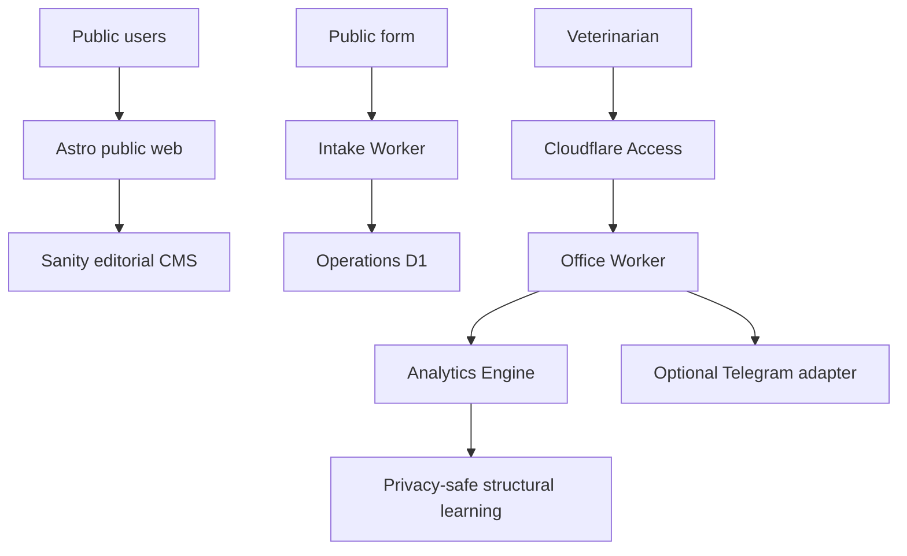

# POLINA VET

Multilingual veterinary guidance, intake, and private clinical operations for pets and farm animals.

[](https://github.com/iurii-izman/polina-vet/actions/workflows/ci.yml)

[Live site](https://lina.aipipeline.cc)

**Alpha · Live · Development frozen for real-world observation**

## Current status

| Area              | State                             |
| ----------------- | --------------------------------- |
| Public site       | LIVE / INDEXABLE                  |
| Production Office | ACTIVE / ACCESS-PROTECTED         |
| Public Intake     | ACTIVE                            |
| Production D1     | MIGRATED / CLEAN                  |
| Private telemetry | ACTIVE / OBSERVATION READY        |
| Telegram          | DISABLED CLEANLY                  |
| Security baseline | 0 reportable application findings |
| M1–M14.5          | CLOSED                            |
| M15/M16           | NOT STARTED                       |
| Development       | FROZEN / OBSERVATION              |

The public product is launched and the private operational plane is ready for daily veterinary use. Real observation has not started until the first genuine `REAL` telemetry event. Article 22 evidence remains pending; this project does not claim legal compliance or notification completion.

## Architecture



Analytics Engine is privacy-safe workflow telemetry, not a clinical database. Sanity is public editorial content, not a private operational database.

## Privacy and safety boundary

- **Public Sanity:** editorial and public content only.
- **Private D1:** client, patient, holding, and clinical operational data.
- **Analytics Engine:** privacy-safe structural workflow telemetry only.
- **Telegram:** optional outbound notifications with minimized personal data; currently disabled cleanly.
- **Clinical decisions:** controlled by a human veterinarian.
- No public AI diagnosis, owner-facing dosing AI, or emergency-response guarantee.

## Stack

Astro · TypeScript · Sanity · Cloudflare Workers · Cloudflare D1 · Cloudflare Access · Analytics Engine · pnpm · Playwright · axe · GitHub Actions

## Quick start

```powershell
pnpm install
pnpm dev
pnpm dev:studio
pnpm check
pnpm test:m13
pnpm test:m14
pnpm test:m14-5
pnpm test:security
pnpm test:e2e
pnpm test:a11y
pnpm release:validate
```

## Documentation

- [Current project status](docs/PROJECT_STATUS.md)
- [Pause and restart contract](docs/PAUSE_AND_RESTART.md)
- [Architecture](docs/ARCHITECTURE.md)
- [Production operations runbook](docs/OPERATIONS_RUNBOOK.md)
- [Medical safety](docs/MEDICAL_SAFETY.md)
- [Documentation index](docs/README.md)
- [R1 — permanent domain](docs/R1_FINAL_DOMAIN_ACTIVATION.md) · [issue #11](https://github.com/iurii-izman/polina-vet/issues/11)
- [R2 — external channels](docs/R2_EXTERNAL_CHANNELS_ACTIVATION.md) · [issue #12](https://github.com/iurii-izman/polina-vet/issues/12)
- [R3 — production compliance and Intake](docs/R3_PRODUCTION_COMPLIANCE_AND_INTAKE.md) · [issue #18](https://github.com/iurii-izman/polina-vet/issues/18)
- [R4 — dependency maintenance](docs/R4_UPSTREAM_DEPENDENCY_SECURITY_MAINTENANCE.md) · [issue #23](https://github.com/iurii-izman/polina-vet/issues/23)

## Frozen development boundary

M1–M14.5 is the closed implementation baseline. M15 and M16 have not started. During the freeze, only real veterinary use, editorial work, security and bug fixes, incident response, R1–R4 follow-ups, and small evidence-driven repairs are in scope.
