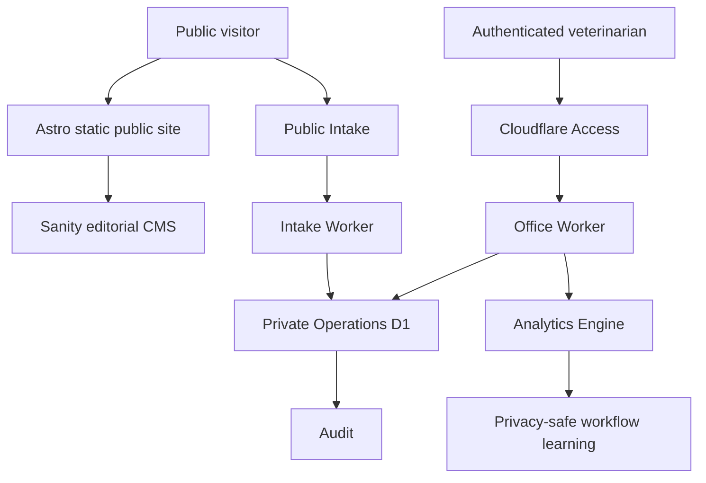

# POLINA VET

Multilingual veterinary guidance, intake, and private clinical operations for pets and farm animals.

[Open the live public site](https://lina.aipipeline.cc)

**Alpha · Live public site · Development paused for observation**

## Current status

| Area              | State                                                |
| ----------------- | ---------------------------------------------------- |
| Public site       | LIVE / INDEXABLE on the temporary production origin  |
| Production Office | BLOCKED — owner identity input required; fail-closed |
| Public Intake     | DISABLED — `PUBLIC_INTAKE_ENABLED=false`             |
| Production D1     | PROVISIONED / MIGRATED / EMPTY / foreign-key clean   |
| Private telemetry | CONFIGURED / observation not started                 |
| Security baseline | 0 reportable application findings                    |
| M1–M14.5          | CLOSED                                               |
| M15/M16           | NOT STARTED                                          |
| Development       | PAUSED                                               |

The public product is launched. Daily veterinary use and real observation remain blocked until the exact owner-approved Cloudflare Access identities are supplied and production Office activation is completed. Article 22 evidence remains pending; this project does not claim legal compliance or notification completion.

## Architecture



Analytics Engine contains structural, privacy-safe workflow telemetry; it is not a clinical data store.

## Privacy and safety boundary

- **Public Sanity:** editorial and public content only.
- **Private D1:** client, patient, holding, and clinical operational data.
- **Analytics Engine:** privacy-safe structural workflow telemetry only.
- **Clinical decisions:** controlled by a human veterinarian.
- No public AI diagnosis, owner-facing dosing calculator, or emergency-response guarantee.

## Stack

Astro · TypeScript · Sanity · Cloudflare Workers · Cloudflare D1 · Cloudflare Access · Analytics Engine · pnpm · Playwright · axe · GitHub Actions

## Quick start

```powershell
pnpm install
pnpm dev
pnpm dev:studio
pnpm check
pnpm test:m13
pnpm test:m14
pnpm test:m14-5
pnpm test:security
pnpm test:e2e
pnpm test:a11y
pnpm release:validate
```

## Documentation

- [Current project status](docs/PROJECT_STATUS.md)
- [Pause and restart contract](docs/PAUSE_AND_RESTART.md)
- [Architecture](docs/ARCHITECTURE.md)
- [Production operations runbook](docs/OPERATIONS_RUNBOOK.md)
- [Medical safety](docs/MEDICAL_SAFETY.md)
- [Documentation index](docs/README.md)
- [R1 — permanent domain](docs/R1_FINAL_DOMAIN_ACTIVATION.md) · [issue #11](https://github.com/iurii-izman/polina-vet/issues/11)
- [R2 — external channels](docs/R2_EXTERNAL_CHANNELS_ACTIVATION.md) · [issue #12](https://github.com/iurii-izman/polina-vet/issues/12)
- [R3 — production compliance and Intake](docs/R3_PRODUCTION_COMPLIANCE_AND_INTAKE.md) · [issue #18](https://github.com/iurii-izman/polina-vet/issues/18)
- [R4 — dependency maintenance](docs/R4_UPSTREAM_DEPENDENCY_SECURITY_MAINTENANCE.md) · [issue #23](https://github.com/iurii-izman/polina-vet/issues/23)

## Development boundary

M1–M14.5 is the closed implementation baseline. M15 and M16 have not started. During the pause, only production operation, incident response, security/dependency maintenance, owner-controlled external setup, editorial governance, and evidence-driven small repairs are in scope.
