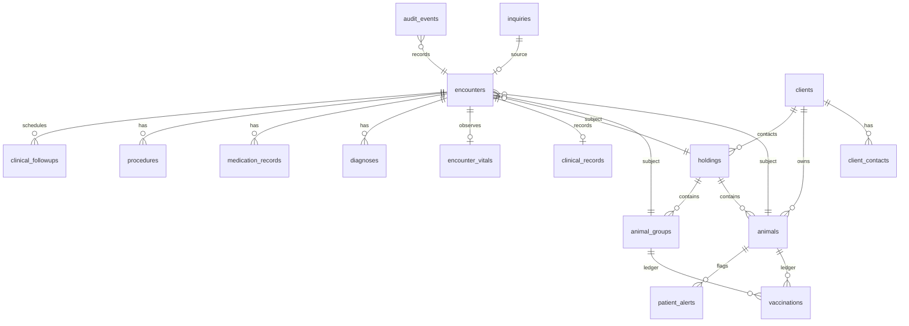

# M14 Data Model

M14 uses the existing operations D1 and additive migration `0002_m14_core` under `apps/intake/migrations`.

## Integrity and deletion

- Encounter subjects use three nullable typed foreign keys with a check constraint requiring exactly one subject.
- Inquiry-to-encounter is `ON DELETE SET NULL`; M13 retention cannot cascade into the clinical graph.
- Operational/clinical records use restrictive subject FKs. Normal Office workflows archive/deactivate rather than hard-delete.
- Vaccinations can exist without an encounter for historical records and point to exactly one individual animal or group.
- Group approximate counts are never changed by encounter population counts.

## Corrections and audit

Mutable records have `record_version`. Updates compare the version and return a conflict on stale writes. `audit_events.changed_fields` contains only allowlisted field names; it never stores before/after clinical text, contact values, or request bodies.
